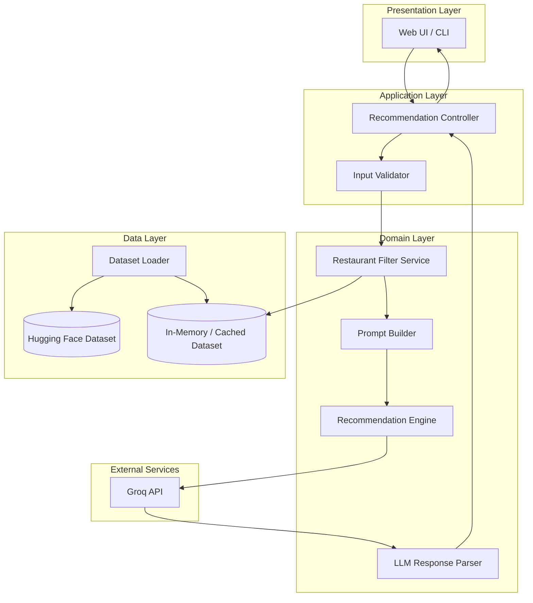
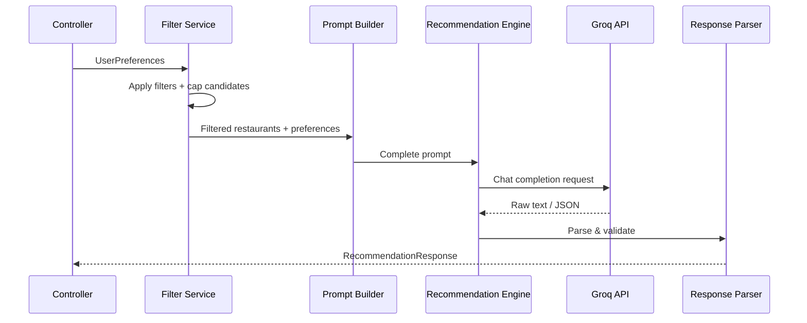
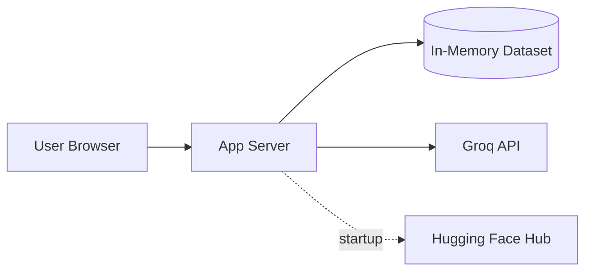

# Architecture: AI-Powered Restaurant Recommendation System

> Derived from [context.md](./context.md) · Zomato-inspired use case

## 1. Purpose

This document describes the technical architecture for a restaurant recommendation service that combines **structured filtering** over a real Zomato dataset with **LLM-based ranking and explanation** powered by **Groq**. The LLM is a core reasoning layer—not a passthrough—and all heavy filtering happens before the Groq API call to keep prompts focused, token-efficient, and cost-effective.

---

## 2. Architectural Principles

| Principle | Rationale |
|-----------|-----------|
| **Filter first, reason second** | Apply deterministic filters on structured data before invoking the LLM |
| **LLM for judgment, not retrieval** | The LLM ranks and explains; it does not replace the database/dataset |
| **Structured I/O at boundaries** | User input and LLM output are validated against schemas |
| **Separation of concerns** | Data ingestion, filtering, prompting, and presentation are independent modules |
| **Graceful degradation** | If the Groq API fails, return filtered results with a fallback message |

---

## 3. High-Level Architecture



### Layer Summary

| Layer | Responsibility |
|-------|----------------|
| **Presentation** | Collect preferences, render ranked recommendations |
| **Application** | HTTP/routing, request validation, orchestration |
| **Domain** | Filtering logic, prompt design, LLM interaction, response parsing |
| **Data** | Load, preprocess, cache, and query restaurant records |
| **External** | Groq API (via `groq` Python SDK) |

---

## 4. Component Design

### 4.1 Data Ingestion Module

**Purpose:** Load and normalize the Zomato dataset from Hugging Face at startup (or on first request).

**Source:**
- Platform: Hugging Face
- Dataset: `ManikaSaini/zomato-restaurant-recommendation`
- URL: https://huggingface.co/datasets/ManikaSaini/zomato-restaurant-recommendation

**Responsibilities:**
1. Download/load dataset via `datasets` library or equivalent
2. Map raw columns to a canonical `Restaurant` schema
3. Normalize types (ratings as float, cost as numeric or bucket)
4. Handle missing/null values
5. Cache processed records in memory (or local parquet) for fast filtering

**Canonical Restaurant Schema:**

```python
Restaurant:
  id: str                    # unique identifier (generated if absent)
  name: str
  location: str              # city/area (e.g., "Delhi", "Bangalore")
  cuisines: list[str]        # e.g., ["Italian", "Pizza"]
  rating: float              # e.g., 4.2
  cost_for_two: int | None   # estimated cost in INR (if available)
  budget_tier: str           # derived: "low" | "medium" | "high"
  raw: dict                  # optional: original row for debugging
```

**Preprocessing steps:**
- Split multi-value cuisine strings into lists
- Derive `budget_tier` from cost fields using configurable thresholds
- Normalize location strings (case-insensitive, trim whitespace)
- Drop or flag rows with critical missing fields (name, location)

---

### 4.2 User Input Module

**Purpose:** Capture and validate user preferences before recommendation.

**Input Schema:**

```python
UserPreferences:
  location: str                          # required
  budget: Literal["low", "medium", "high"]  # required
  cuisine: str | None                    # optional filter
  min_rating: float                      # default: 0.0
  additional_preferences: str | None     # free-text, e.g., "family-friendly, quick service"
```

**Validation rules:**
- `location` must be non-empty
- `min_rating` in range `[0.0, 5.0]`
- `budget` must be one of the allowed enum values
- Sanitize free-text fields (length limits, strip HTML)

**Delivery options:**
- Web form (React/Streamlit/Gradio)
- REST API JSON body
- CLI flags for local development

---

### 4.3 Integration Layer (Filter + Prompt Builder)

This layer sits between user input and the LLM. It has two sub-components.

#### 4.3.1 Restaurant Filter Service

**Purpose:** Deterministically narrow the dataset to a candidate set.

**Filter pipeline (applied in order):**

```
All restaurants
  → filter by location (case-insensitive match)
  → filter by budget_tier
  → filter by cuisine (if specified; partial match on cuisine list)
  → filter by min_rating
  → cap to top N candidates (e.g., 20–50) by rating for LLM context window
```

**Output:** Ordered list of `Restaurant` records passed to the prompt builder.

**Edge cases:**
- Zero matches → return user-facing message suggesting broader criteria (no LLM call)
- Too many matches → sort by rating descending, take top N

#### 4.3.2 Prompt Builder

**Purpose:** Construct a structured prompt that gives the LLM enough context to rank and explain.

**Prompt structure:**

```
[System]
You are a restaurant recommendation assistant for Indian cities.
Given user preferences and a list of candidate restaurants (JSON),
rank the top 5 and explain why each fits.

[User Preferences]
{serialized UserPreferences}

[Candidate Restaurants]
{JSON array of filtered restaurants}

[Instructions]
- Rank by fit to preferences, not rating alone
- Consider additional_preferences in free-text reasoning
- Return valid JSON only (see schema below)

[Output Schema]
{
  "summary": "...",
  "recommendations": [
    {
      "rank": 1,
      "restaurant_name": "...",
      "cuisine": "...",
      "rating": 4.5,
      "estimated_cost": "...",
      "explanation": "..."
    }
  ]
}
```

---

### 4.4 Recommendation Engine (Groq LLM Module)

**Purpose:** Invoke Groq's chat completion API, parse structured output, and map back to domain objects.

**Flow:**



**Engine responsibilities:**
1. Call Groq with a configured model (e.g., `llama-3.3-70b-versatile`) and low temperature (0.2–0.4) for consistent ranking
2. Set `max_tokens` based on candidate count and expected JSON response size
3. Retry on transient Groq API failures (429/5xx) with exponential backoff
4. Validate LLM JSON against output schema
5. Fallback: if parsing fails, return top 5 filtered restaurants sorted by rating with a generic explanation

**Groq client:**

The project uses the official [`groq`](https://github.com/groq/groq-python) Python SDK. A thin wrapper keeps the recommendation engine decoupled from HTTP details:

```python
from groq import Groq

class GroqLLMClient:
    def __init__(self, api_key: str, model: str):
        self._client = Groq(api_key=api_key)
        self._model = model

    def complete(self, system: str, user: str) -> str:
        response = self._client.chat.completions.create(
            model=self._model,
            messages=[
                {"role": "system", "content": system},
                {"role": "user", "content": user},
            ],
            temperature=0.3,
            response_format={"type": "json_object"},  # when supported by model
        )
        return response.choices[0].message.content
```

**Recommended Groq models:**

| Model | Use case |
|-------|----------|
| `llama-3.3-70b-versatile` | Default—strong reasoning for ranking and explanations |
| `llama-3.1-8b-instant` | Faster, lower-latency responses for prototyping |

Authentication is via the `GROQ_API_KEY` environment variable (obtain from [Groq Console](https://console.groq.com/)).

---

### 4.5 Output Display Module

**Purpose:** Present recommendations in a clear, user-friendly format.

**Response Schema:**

```python
RecommendationResponse:
  summary: str | None
  recommendations: list[Recommendation]

Recommendation:
  rank: int
  restaurant_name: str
  cuisine: str
  rating: float
  estimated_cost: str
  explanation: str
```

**UI rendering (each card/row):**
- Restaurant Name (headline)
- Cuisine (badge/tag)
- Rating (star display)
- Estimated Cost
- AI-generated explanation (body text)
- Optional: overall summary at top

---

## 5. End-to-End Data Flow

```
┌─────────────────────────────────────────────────────────────────────────┐
│ STARTUP                                                                 │
│  Hugging Face → Loader → Preprocess → Cache (Restaurant[])              │
└─────────────────────────────────────────────────────────────────────────┘
                                    │
                                    ▼
┌─────────────────────────────────────────────────────────────────────────┐
│ REQUEST                                                                 │
│  User → UI → POST /recommend → Validate UserPreferences                 │
└─────────────────────────────────────────────────────────────────────────┘
                                    │
                                    ▼
┌─────────────────────────────────────────────────────────────────────────┐
│ FILTER                                                                  │
│  Cache → location + budget + cuisine + min_rating → candidates[N]       │
└─────────────────────────────────────────────────────────────────────────┘
                                    │
                          ┌─────────┴─────────┐
                          ▼                   ▼
                    0 candidates         N candidates
                          │                   │
                          ▼                   ▼
                   Empty response      Build LLM prompt
                                              │
                                              ▼
                                        LLM rank + explain
                                              │
                                              ▼
                                        Parse JSON response
                                              │
                                              ▼
                                   Return RecommendationResponse → UI
```

---

## 6. Proposed Project Structure

```
zomato-milestone1/
├── docs/
│   ├── ProblemStatement.txt
│   ├── context.md
│   └── architecture.md
├── src/
│   ├── __init__.py
│   ├── main.py                 # App entrypoint (FastAPI / Streamlit)
│   ├── config.py               # Env vars, budget thresholds, model config
│   ├── models/
│   │   ├── restaurant.py       # Restaurant dataclass
│   │   ├── preferences.py      # UserPreferences
│   │   └── recommendation.py   # RecommendationResponse
│   ├── data/
│   │   ├── loader.py           # Hugging Face dataset loading
│   │   └── preprocessor.py     # Normalization, budget tier derivation
│   ├── services/
│   │   ├── filter_service.py   # Deterministic filtering
│   │   ├── prompt_builder.py   # LLM prompt construction
│   │   └── recommendation_engine.py  # Orchestrates filter → LLM → parse
│   ├── llm/
│   │   ├── groq_client.py      # Groq SDK wrapper (chat completions)
│   │   └── parser.py           # JSON extraction & validation
│   └── api/
│       ├── routes.py           # REST endpoints
│       └── schemas.py          # Pydantic request/response models
├── tests/
│   ├── test_filter_service.py
│   ├── test_prompt_builder.py
│   └── test_parser.py
├── requirements.txt
├── .env.example                # GROQ_API_KEY, GROQ_MODEL, etc.
└── README.md
```

---

## 7. API Design

### `POST /api/v1/recommend`

**Request:**

```json
{
  "location": "Bangalore",
  "budget": "medium",
  "cuisine": "Italian",
  "min_rating": 4.0,
  "additional_preferences": "family-friendly, quick service"
}
```

**Response (200):**

```json
{
  "summary": "Here are 5 Italian spots in Bangalore that fit a medium budget...",
  "recommendations": [
    {
      "rank": 1,
      "restaurant_name": "Example Bistro",
      "cuisine": "Italian",
      "rating": 4.5,
      "estimated_cost": "₹800 for two",
      "explanation": "Highly rated Italian restaurant in Bangalore with moderate pricing, suitable for families."
    }
  ]
}
```

**Error responses:**

| Status | Condition |
|--------|-----------|
| `400` | Invalid input (missing location, bad budget enum) |
| `404` | No restaurants match filters (with suggestions) |
| `502` | Groq API unavailable (optional: fallback response) |
| `500` | Unexpected server error |

### `GET /api/v1/health`

Returns dataset load status and Groq API connectivity.

---

## 8. Configuration

| Variable | Description | Example |
|----------|-------------|---------|
| `HF_DATASET_NAME` | Hugging Face dataset ID | `ManikaSaini/zomato-restaurant-recommendation` |
| `GROQ_API_KEY` | Groq API key (secret) | — |
| `GROQ_MODEL` | Groq model ID | `llama-3.3-70b-versatile` |
| `GROQ_TEMPERATURE` | Sampling temperature | `0.3` |
| `MAX_CANDIDATES` | Max restaurants sent to Groq | `30` |
| `TOP_K_RESULTS` | Recommendations returned | `5` |
| `BUDGET_LOW_MAX` | Cost threshold for "low" | `500` |
| `BUDGET_MEDIUM_MAX` | Cost threshold for "medium" | `1500` |

---

## 9. Technology Stack (Recommended)

| Concern | Option A (API-first) | Option B (Rapid prototype) |
|---------|----------------------|----------------------------|
| Backend | Python + FastAPI | Python + Streamlit |
| Data loading | `datasets` (Hugging Face) | Same |
| Validation | Pydantic v2 | Pydantic v2 |
| LLM | Groq API (`groq` SDK) | Same |
| Frontend | React or HTMX | Streamlit built-in UI |
| Testing | pytest | pytest |
| Config | python-dotenv | Same |

Both options share the same **domain layer** (filter, prompt, engine)—only the presentation layer differs.

**Key Python dependencies:** `groq`, `datasets`, `pydantic`, `python-dotenv` (+ `fastapi`/`uvicorn` or `streamlit` depending on option).

---

## 10. Non-Functional Requirements

### Performance
- Dataset loaded once at startup; filtering is in-memory O(n)
- Target: filter + Groq round-trip under 2–5 seconds (Groq's LPU inference is optimized for low latency)
- Cap candidates to control token usage and stay within Groq rate limits

### Reliability
- Retry Groq API calls on 429/5xx with exponential backoff
- Structured output parsing with fallback to rating-sorted list
- Health check endpoint for ops visibility

### Security
- `GROQ_API_KEY` in environment variables only (never committed)
- Input sanitization on free-text fields
- Rate limiting on public endpoints (if deployed)

### Observability
- Log filter counts (input size → candidate size)
- Log Groq request latency and token usage (`usage.prompt_tokens`, `usage.completion_tokens`)
- Do not log full prompts containing PII in production

---

## 11. Testing Strategy

| Layer | Test focus |
|-------|------------|
| **Preprocessor** | Column mapping, budget tier derivation, null handling |
| **Filter service** | Location/cuisine/budget/rating filters; empty result handling |
| **Prompt builder** | Prompt contains all preferences and candidate JSON |
| **Parser** | Valid JSON, malformed JSON fallback, schema validation |
| **Integration** | End-to-end with mocked Groq client |
| **E2E (optional)** | UI form submit → displayed recommendations |

Use a **mock Groq client** in unit/integration tests to avoid API costs and flakiness.

---

## 12. Deployment Topology



**Milestone 1 (local/dev):**
- Single process: load dataset on start, serve UI or API locally
- No external database required

**Future scaling (out of scope for milestone 1):**
- Persist preprocessed dataset to object storage or DB
- Cache Groq responses by preference hash
- Horizontal scaling with shared Redis cache

---

## 13. Success Criteria Mapping

| # | Criterion (from context.md) | Architectural element |
|---|----------------------------|------------------------|
| 1 | User specifies preferences | User Input Module + API schema |
| 2 | Filter Zomato dataset | Filter Service on cached Restaurant records |
| 3 | Feed filtered data to LLM | Prompt Builder + Groq Recommendation Engine |
| 4 | LLM returns ranked recommendations with explanations | Groq LLM Module + Response Parser |
| 5 | Display name, cuisine, rating, cost, explanation | Output Display Module + Recommendation schema |

---

## 14. Out of Scope (Milestone 1)

- User accounts, authentication, or saved preference history
- Real-time Zomato API integration
- Geolocation / map-based search
- Payment or booking flows
- Multi-language support

---

## 15. Related Documents

- [context.md](./context.md) — Project requirements and workflow summary
- [ProblemStatement.txt](./ProblemStatement.txt) — Original problem statement
- [edge-case.md](./edge-case.md) — Edge cases, failure modes, and mitigation strategies

