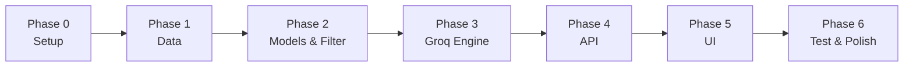

# Phase-Wise Implementation Plan

> AI-Powered Restaurant Recommendation System · Zomato-inspired use case  
> Based on [context.md](./context.md) and [architecture.md](./architecture.md)

## Overview

This plan breaks milestone 1 into **7 phases**, ordered by dependency. Each phase has clear deliverables, files to create, and acceptance criteria mapped to the [success criteria](./context.md#success-criteria) in `context.md`.

**Recommended stack:** Python · FastAPI (or Streamlit for rapid UI) · Hugging Face `datasets` · Groq API · pytest



---

## Phase Summary

| Phase | Name | Primary goal | Maps to workflow |
|-------|------|--------------|------------------|
| 0 | Project Setup | Repo scaffold, config, dependencies | — |
| 1 | Data Ingestion | Load & preprocess Hugging Face dataset | Workflow §1 |
| 2 | Domain Models & Filtering | Schemas + deterministic filter pipeline | Workflow §2–§3 (filter half) |
| 3 | Groq Recommendation Engine | Prompt, Groq client, parser, orchestration | Workflow §3–§4 |
| 4 | Application & API Layer | REST endpoints, validation, orchestration | Architecture §7 |
| 5 | Presentation Layer | User-facing UI for input and results | Workflow §5 |
| 6 | Testing, Hardening & Docs | Tests, fallbacks, README, demo readiness | Success criteria 1–5 |

---

## Phase 0: Project Setup & Configuration

**Goal:** Establish project structure, dependencies, and environment configuration so later phases can build on a consistent foundation.

### Tasks

- [ ] Initialize Python project with `src/` layout per [architecture.md §6](./architecture.md#6-proposed-project-structure)
- [ ] Create `requirements.txt` with core dependencies:
  - `groq`, `datasets`, `pydantic`, `python-dotenv`
  - `fastapi`, `uvicorn` (Option A) **or** `streamlit` (Option B)
  - `pytest` (dev)
- [ ] Add `.env.example` with required variables:
  - `GROQ_API_KEY`, `GROQ_MODEL`, `GROQ_TEMPERATURE`
  - `HF_DATASET_NAME`, `MAX_CANDIDATES`, `TOP_K_RESULTS`
  - `BUDGET_LOW_MAX`, `BUDGET_MEDIUM_MAX`
- [ ] Implement `src/config.py` — load env vars via `python-dotenv`, expose a typed settings object
- [ ] Add `.gitignore` (`.env`, `__pycache__`, `.venv`, etc.)
- [ ] Create placeholder `README.md` with setup instructions (expand in Phase 6)

### Deliverables

| File | Purpose |
|------|---------|
| `src/config.py` | Central configuration |
| `requirements.txt` | Dependency manifest |
| `.env.example` | Documented env template |
| `.gitignore` | Exclude secrets and artifacts |

### Acceptance criteria

- [ ] Virtual environment installs without errors
- [ ] `config.py` reads all env vars defined in [architecture.md §8](./architecture.md#8-configuration)
- [ ] App fails fast with a clear message if `GROQ_API_KEY` is missing (when Groq is needed)

### Dependencies

None — start here.

---

## Phase 1: Data Ingestion

**Goal:** Load the Zomato dataset from Hugging Face, normalize it into the canonical `Restaurant` schema, and cache it in memory for filtering.

**Maps to:** Context workflow §1 · Architecture §4.1

### Tasks

- [ ] Inspect raw dataset columns from `ManikaSaini/zomato-restaurant-recommendation`
- [ ] Implement `src/models/restaurant.py` — `Restaurant` dataclass / Pydantic model:
  - `id`, `name`, `location`, `cuisines`, `rating`, `cost_for_two`, `budget_tier`, `raw` (optional)
- [ ] Implement `src/data/loader.py`:
  - Load dataset via Hugging Face `datasets` library
  - Return raw rows for preprocessing
- [ ] Implement `src/data/preprocessor.py`:
  - Map raw columns → `Restaurant`
  - Split multi-value cuisine strings into `list[str]`
  - Normalize location (trim, case handling)
  - Parse rating as `float`; handle nulls
  - Derive `budget_tier` (`low` / `medium` / `high`) using configurable thresholds from `config.py`
  - Drop or skip rows missing critical fields (`name`, `location`)
- [ ] Add in-memory cache module or singleton that holds `list[Restaurant]` after startup load
- [ ] Write `tests/test_preprocessor.py` — column mapping, budget tiers, null handling

### Deliverables

| File | Purpose |
|------|---------|
| `src/models/restaurant.py` | Canonical restaurant schema |
| `src/data/loader.py` | Hugging Face dataset loader |
| `src/data/preprocessor.py` | Normalization & budget derivation |
| `tests/test_preprocessor.py` | Unit tests for preprocessing |

### Acceptance criteria

- [ ] Dataset loads successfully from Hugging Face on first run
- [ ] Preprocessed records match the schema in [architecture.md §4.1](./architecture.md#41-data-ingestion-module)
- [ ] Budget tiers are assigned consistently using `BUDGET_LOW_MAX` / `BUDGET_MEDIUM_MAX`
- [ ] Cache holds all valid restaurants and is queryable from other modules
- [ ] Preprocessor tests pass

### Dependencies

Phase 0 complete.

---

## Phase 2: Domain Models & Filter Service

**Goal:** Define user preference schemas and implement the deterministic filter pipeline that narrows candidates **before** any Groq call.

**Maps to:** Context workflow §2–§3 (filter) · Architecture §4.2, §4.3.1

### Tasks

- [ ] Implement `src/models/preferences.py` — `UserPreferences`:
  - `location` (required), `budget` (enum), `cuisine` (optional), `min_rating` (default 0.0), `additional_preferences` (optional)
  - Pydantic validators: non-empty location, rating in `[0.0, 5.0]`, valid budget enum
  - Sanitize free-text (max length, strip unsafe content)
- [ ] Implement `src/services/filter_service.py` with ordered pipeline:
  1. Filter by location (case-insensitive)
  2. Filter by `budget_tier`
  3. Filter by cuisine (partial match on `cuisines` list, if specified)
  4. Filter by `min_rating`
  5. Sort by rating descending; cap to `MAX_CANDIDATES`
- [ ] Handle edge cases:
  - **Zero matches** → return empty list + helper message for caller
  - **Many matches** → cap to top N by rating
- [ ] Write `tests/test_filter_service.py` — each filter dimension, empty results, cap behavior

### Deliverables

| File | Purpose |
|------|---------|
| `src/models/preferences.py` | User input schema |
| `src/services/filter_service.py` | Deterministic filtering |
| `tests/test_filter_service.py` | Filter unit tests |

### Acceptance criteria

- [ ] **Success criterion 2:** System filters the Zomato dataset by location, budget, cuisine, and minimum rating
- [ ] Filter pipeline order matches [architecture.md §4.3.1](./architecture.md#431-restaurant-filter-service)
- [ ] Zero-match case returns gracefully without raising
- [ ] All filter service tests pass

### Dependencies

Phase 1 complete (cached `Restaurant` list required).

---

## Phase 3: Groq Recommendation Engine

**Goal:** Build the integration layer—prompt construction, Groq API client, response parsing, and orchestration with fallback behavior.

**Maps to:** Context workflow §3–§4 · Architecture §4.3.2, §4.4

### Tasks

- [ ] Implement `src/models/recommendation.py`:
  - `Recommendation` — rank, restaurant_name, cuisine, rating, estimated_cost, explanation
  - `RecommendationResponse` — summary, recommendations list
- [ ] Implement `src/services/prompt_builder.py`:
  - System message: restaurant assistant role for Indian cities
  - Inject serialized `UserPreferences` and candidate restaurant JSON
  - Include output JSON schema instructions (top `TOP_K_RESULTS`)
  - Consider `additional_preferences` in instructions
- [ ] Implement `src/llm/groq_client.py`:
  - Wrap official `groq` SDK (`GroqLLMClient`)
  - Use `GROQ_MODEL`, `GROQ_TEMPERATURE`, `GROQ_API_KEY` from config
  - Set `max_tokens` appropriately; use `response_format={"type": "json_object"}` when supported
  - Retry on 429/5xx with exponential backoff
- [ ] Implement `src/llm/parser.py`:
  - Parse Groq JSON response into `RecommendationResponse`
  - Validate required fields; handle malformed JSON
  - **Fallback:** if parsing fails, build response from top filtered restaurants (rating-sorted) with generic explanations
- [ ] Implement `src/services/recommendation_engine.py`:
  - Orchestrate: filter → prompt → Groq → parse
  - Skip Groq call when filter returns zero candidates
  - Log candidate count and Groq latency/token usage
- [ ] Write tests:
  - `tests/test_prompt_builder.py` — preferences and candidates appear in prompt
  - `tests/test_parser.py` — valid JSON, malformed JSON, fallback path
  - Integration test with **mocked** Groq client (no live API in CI)

### Deliverables

| File | Purpose |
|------|---------|
| `src/models/recommendation.py` | Output schemas |
| `src/services/prompt_builder.py` | LLM prompt construction |
| `src/llm/groq_client.py` | Groq SDK wrapper |
| `src/llm/parser.py` | Response parsing & fallback |
| `src/services/recommendation_engine.py` | End-to-end domain orchestration |
| `tests/test_prompt_builder.py` | Prompt tests |
| `tests/test_parser.py` | Parser tests |

### Acceptance criteria

- [ ] **Success criterion 3:** Filtered data is passed to Groq via a structured, well-designed prompt
- [ ] **Success criterion 4:** Groq returns ranked recommendations with human-readable explanations (and optional summary)
- [ ] Groq client uses `llama-3.3-70b-versatile` (or configured model) per [architecture.md §4.4](./architecture.md#44-recommendation-engine-groq-llm-module)
- [ ] Fallback works when Groq fails or returns invalid JSON
- [ ] All unit/integration tests pass with mocked Groq client

### Dependencies

Phase 2 complete.

### Manual verification (requires Groq API key)

```bash
# After wiring a temporary CLI or script:
# Submit sample preferences → confirm JSON recommendations with explanations
```

---

## Phase 4: Application & API Layer

**Goal:** Expose the recommendation engine via REST endpoints with request validation and proper HTTP error handling.

**Maps to:** Architecture §7 · Application layer in §3

### Tasks

- [ ] Implement `src/api/schemas.py` — Pydantic request/response models aligned with API spec
- [ ] Implement `src/api/routes.py`:
  - `POST /api/v1/recommend` — accept `UserPreferences`, return `RecommendationResponse`
  - `GET /api/v1/health` — dataset loaded status + Groq connectivity check
- [ ] Implement `src/main.py`:
  - FastAPI app factory
  - Load dataset into cache on startup (`lifespan` / `@app.on_event("startup")`)
  - Register routes
  - Global exception handlers for 400, 404, 502, 500
- [ ] Map error conditions per [architecture.md §7](./architecture.md#7-api-design):
  - `400` — invalid input
  - `404` — no matching restaurants (include suggestion message)
  - `502` — Groq unavailable (optional fallback in body)
  - `500` — unexpected errors
- [ ] Smoke-test with `curl` or HTTP client

### Deliverables

| File | Purpose |
|------|---------|
| `src/api/schemas.py` | API Pydantic models |
| `src/api/routes.py` | REST route handlers |
| `src/main.py` | App entrypoint & startup lifecycle |

### Acceptance criteria

- [ ] `POST /api/v1/recommend` accepts the sample request from architecture.md and returns structured JSON
- [ ] `GET /api/v1/health` reports dataset and Groq status
- [ ] Invalid requests return `400` with descriptive errors
- [ ] Zero-match requests return `404` without calling Groq
- [ ] Server starts locally via `uvicorn src.main:app --reload`

### Dependencies

Phase 3 complete.

---

## Phase 5: Presentation Layer

**Goal:** Provide a user-friendly interface to collect preferences and display ranked recommendations with all required fields.

**Maps to:** Context workflow §5 · Architecture §4.5

### Option A — Streamlit (recommended for milestone 1 speed)

- [ ] Create Streamlit app in `src/main.py` or `src/ui/app.py`
- [ ] Form fields: location, budget (select), cuisine, min rating (slider), additional preferences (textarea)
- [ ] On submit: call `RecommendationEngine` directly (or POST to local API)
- [ ] Display results:
  - Optional summary at top
  - Cards/rows with: name, cuisine, rating, estimated cost, AI explanation

### Option B — FastAPI + separate frontend

- [ ] Keep FastAPI backend from Phase 4
- [ ] Add minimal HTML/HTMX page or React frontend consuming `/api/v1/recommend`
- [ ] Match same form fields and result layout as Option A

### Tasks (both options)

- [ ] Loading state while Groq request is in flight
- [ ] User-friendly empty-state message when no restaurants match
- [ ] Error display for API/Groq failures

### Deliverables

| File | Purpose |
|------|---------|
| `src/ui/app.py` or integrated `src/main.py` | User interface |
| Optional static assets | CSS/layout for Option B |

### Acceptance criteria

- [ ] **Success criterion 1:** User can specify location, budget, cuisine, minimum rating, and additional preferences
- [ ] **Success criterion 5:** Results display restaurant name, cuisine, rating, estimated cost, and AI explanation
- [ ] End-to-end flow works: form → filter → Groq → displayed recommendations
- [ ] UI handles empty and error states gracefully

### Dependencies

Phase 4 complete (Option B) **or** Phase 3 complete (Option A — Streamlit can skip REST layer initially).

---

## Phase 6: Testing, Hardening & Documentation

**Goal:** Finalize quality, observability, and documentation so the project is demo-ready and maintainable.

**Maps to:** Architecture §10–§11 · Context success criteria 1–5

### Tasks

#### Testing

- [ ] Ensure full test suite passes: `pytest tests/ -v`
- [ ] Add integration test: mocked Groq end-to-end through `RecommendationEngine`
- [ ] Optional: one manual E2E checklist (UI submit → verify 5 recommendations)

#### Hardening

- [ ] Verify graceful degradation paths:
  - Groq timeout / 502 → fallback recommendations
  - Invalid Groq JSON → parser fallback
  - Zero filter matches → no Groq call
- [ ] Add structured logging:
  - Filter input size → candidate count
  - Groq latency and token usage
- [ ] Confirm `GROQ_API_KEY` is never logged or committed
- [ ] Sanitize `additional_preferences` input

#### Documentation

- [ ] Complete `README.md`:
  - Project overview
  - Prerequisites (Python version, Groq API key)
  - Setup: venv, `pip install`, `.env` configuration
  - Run instructions (API and/or UI)
  - Example request/response
  - How to run tests
- [ ] Verify all docs cross-link: `context.md`, `architecture.md`, `implementation-plan.md`

### Deliverables

| Artifact | Purpose |
|----------|---------|
| Full `tests/` suite | Automated quality gate |
| `README.md` | Developer & demo guide |
| Logging in engine/filter | Observability |

### Acceptance criteria

- [ ] All 5 [success criteria](./context.md#success-criteria) verified end-to-end
- [ ] `pytest` passes locally
- [ ] README allows a new developer to run the app from scratch
- [ ] No secrets in git history or committed files

### Dependencies

Phases 0–5 complete.

---

## Success Criteria Traceability

| # | Success criterion | Completed in phase |
|---|-------------------|-------------------|
| 1 | User specifies preferences | Phase 2 (schema), Phase 5 (UI) |
| 2 | System filters dataset | Phase 2 |
| 3 | Filtered data fed to LLM via prompt | Phase 3 |
| 4 | LLM ranks with explanations | Phase 3 |
| 5 | Results displayed clearly | Phase 5 |

---

## Suggested Implementation Order (Checklist)

Use this as a single sprint board across phases:

```
Phase 0  □ Setup repo, config, requirements
Phase 1  □ Loader → preprocessor → cache → tests
Phase 2  □ UserPreferences → filter service → tests
Phase 3  □ Prompt builder → Groq client → parser → engine → tests
Phase 4  □ FastAPI routes → health → error handling → smoke test
Phase 5  □ UI form → results display → empty/error states
Phase 6  □ Full pytest → fallbacks → logging → README
```

---

## Risk Register

| Risk | Mitigation | Phase |
|------|------------|-------|
| Dataset column names differ from assumptions | Inspect dataset in Phase 1 before writing mapper | 1 |
| Groq rate limits (429) | Retry with backoff; cap `MAX_CANDIDATES` | 3 |
| Groq returns non-JSON | Parser fallback to rating-sorted list | 3 |
| Invalid/missing cost field | Allow `cost_for_two=None`; derive budget tier with fallback | 1 |
| Slow first Hugging Face download | Document cache behavior; load once at startup | 1, 4 |
| API costs during dev | Mock Groq in tests; use `llama-3.1-8b-instant` for rapid iteration | 3, 6 |

---

## Out of Scope (Do Not Implement in Milestone 1)

Per [architecture.md §14](./architecture.md#14-out-of-scope-milestone-1):

- User accounts or authentication
- Real-time Zomato API
- Geolocation / maps
- Payment or booking
- Multi-language support
- Redis caching, horizontal scaling, response caching

---

## Related Documents

- [context.md](./context.md) — Requirements and workflow
- [architecture.md](./architecture.md) — Technical design and Groq integration
- [ProblemStatement.txt](./ProblemStatement.txt) — Original problem statement
- [edge-case.md](./edge-case.md) — Edge cases, failure modes, and mitigation strategies

